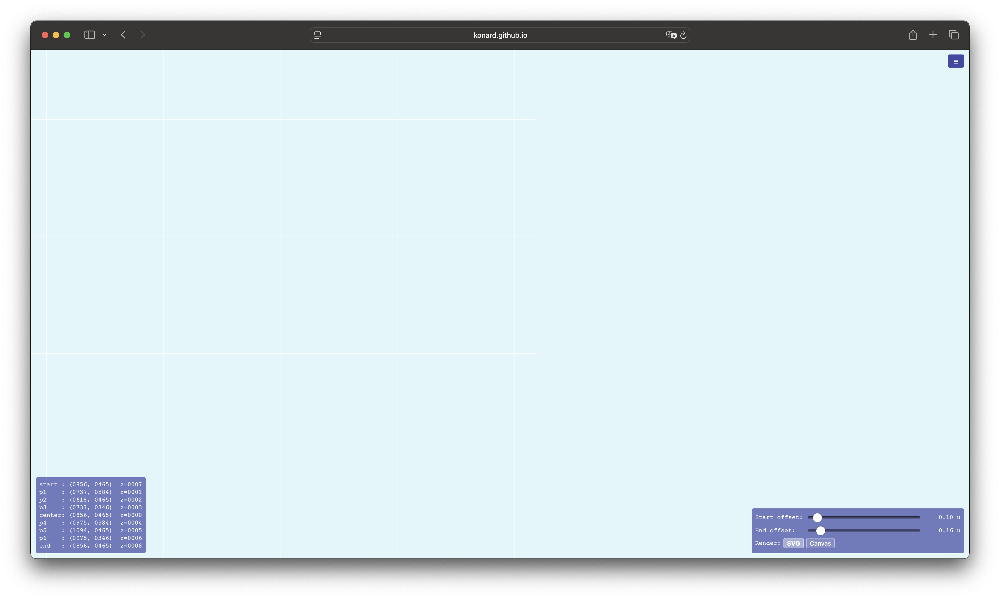

# Case Study: Issue #15 — Background Grid in Animated Blueprint Is Not Infinite

## Overview

**Issue:** [#15 — Backgroud grid in animated blueprint is not infinite](https://github.com/konard/links-visuals/issues/15)

**Repository:** [konard/links-visuals](https://github.com/konard/links-visuals)

**File affected:** `animated-blueprint.html` (via module `js/grid.mjs` and `js/svg-setup.mjs`)

**Status:** Fixed in PR [#16](https://github.com/konard/links-visuals/pull/16)

---

## Symptom

When the user pans or zooms the canvas in `animated-blueprint.html`, the background grid does not fill the entire viewport. Instead, the grid has visible edges — a rectangular boundary beyond which only the bare `#E0F7FA` (light blue) background is visible. The grid appears finite rather than infinite.

Screenshot from the issue (before fix):



---

## Timeline / Sequence of Events

1. **Initial blueprint implementation** — A static `blueprint.html` was created with an infinite SVG grid using `patternUnits="userSpaceOnUse"` and a large rect (`±1e6` extent).

2. **Pan/zoom feature added** — Canvas pan and zoom were implemented using a **CSS transform** on the SVG element (`translate + scale`). This approach was chosen specifically to preserve SVG marker rendering correctness (see [failed-attempts/](../../failed-attempts/) directory for many broken iterations that used SVG group transforms).

3. **Animated blueprint created** — `animated-blueprint.html` was extracted from `blueprint.html` and extended with IK animation. The JS was split into modules under `./js/`. The infinite grid was implemented in `js/grid.mjs`.

4. **Regression introduced** — At some point, the SVG `overflow` attribute was not set. The SVG spec mandates that the **outermost SVG element** embedded in HTML has `overflow:hidden` by default (per SVG 1.1 §14.3.3 / SVG 2 §10.1). This default clips all SVG content outside the SVG's own `width × height` viewport rectangle.

5. **Bug manifests** — Because the CSS transform is applied to the SVG element *after* SVG internal clipping, when the user pans the canvas (e.g., by `+200px` in both axes), the SVG element shifts on screen but its painted area is still only the original `(0, 0, width, height)` SVG viewport region. The grid stops at the old viewport edges, leaving bare background visible.

---

## Root Cause Analysis

### The Architecture

The pan/zoom in `animated-blueprint.html` uses a **CSS `transform`** on the SVG element:

```javascript
// js/svg-setup.mjs — applyCanvasTransform()
state.svg.style("transform",
  `translate(${state.canvasOffsetX}px, ${state.canvasOffsetY}px) scale(${state.canvasScale})`);
state.svg.style("transform-origin", "0 0");
```

This design was chosen deliberately: SVG marker rendering with `markerUnits="strokeWidth"` is sensitive to the SVG current transformation matrix (CTM). Using an SVG group transform or `viewBox` manipulation changes the CTM and causes markers to render at wrong sizes. The CSS transform sidesteps this by keeping the SVG user-space unchanged.

### The Grid Implementation

The grid in `js/grid.mjs` uses two SVG `<pattern>` elements with `patternUnits="userSpaceOnUse"` and two large `<rect>` elements:

```javascript
const GRID_EXTENT = 1e6;
state.gridGroup.append("rect")
  .attr("x", -GRID_EXTENT).attr("y", -GRID_EXTENT)
  .attr("width", 2 * GRID_EXTENT).attr("height", 2 * GRID_EXTENT)
  .attr("fill", `url(#${MINOR_PATTERN_ID})`);
```

The intent is correct — the rects extend `±1,000,000` pixels in SVG coordinate space, far more than any practical pan distance.

### The Bug: SVG Default `overflow:hidden`

Per the **SVG specification**:
- For an SVG element **embedded as the root in HTML** (as a child of `<body>`), the default `overflow` value is **`hidden`**.
- For nested SVG elements, the default is `visible`.

This means the SVG element clips all content to its `width × height` rectangle **in its own user coordinate space**, before any CSS transforms are applied.

**Consequence:** The large grid rects (`-1e6, -1e6, 2e6, 2e6`) are effectively clipped to `(0, 0, width, height)` before being handed to the CSS rendering engine. When the CSS transform then translates the element, the grid only exists in the region that was inside the original SVG viewport.

### Visualization

```
SVG user coordinates (before CSS transform):
┌──────────────────────────────┐ ← SVG overflow clips here (0,0 to width,height)
│ ░░░░░░░░░░░░░░░░░░░░░░░░░░░  │ ← grid lines (clipped to viewport)
│ ░░░░░░░░░░░░░░░░░░░░░░░░░░░  │
│ ░░░░░░░░░░░░░░░░░░░░░░░░░░░  │
└──────────────────────────────┘

After CSS translate(+200px, +200px):
                 Screen area
┌──────────────────────────────┐
│░░ BARE BACKGROUND ░░░░░░░░░░ │ ← 200px strip: no grid
│░░░░░░  ┌────────────────┐   │
│░░░░░░  │ grid lines     │   │
│░░░░░░  │                │   │
│░░░░░░  └────────────────┘   │ ← grid box smaller than screen
└──────────────────────────────┘
         ↑ SVG element shifted, but grid stops where SVG viewport edge was
```

### Why `GRID_EXTENT = 1e6` Was Not Enough

The large extent would be sufficient IF the SVG allowed painting at negative coordinates (i.e., `overflow:visible`). Without that, the grid is clipped to `(0, 0)` regardless of how large the rect is. Content at `x < 0` or `y < 0` is invisible.

---

## Solution

### Option A: Add `overflow="visible"` to the SVG element (✅ Chosen)

**One-line fix:** In `js/svg-setup.mjs`, add:
```javascript
svg.attr("overflow", "visible");
```

This overrides the SVG spec default of `hidden` for the outermost SVG element. The grid rects then paint their full `±1e6` extent. The CSS transform moves this fully-painted content, giving a genuinely infinite grid.

**Why this is correct:**
- Minimal change — does not affect any other module or the pan/zoom math.
- Does not affect CSS marker rendering (which depends on SVG CTM, not SVG overflow).
- `GRID_EXTENT = 1e6` is more than sufficient for any practical pan distance.
- The body has `overflow:hidden`, so content far outside the browser window is not rendered.

### Option B: Use SVG group transform instead of CSS transform (❌ Rejected)

Moving the transform inside SVG (via `<g transform="...">` or `viewBox`) would fix the overflow clipping. However, this changes the SVG CTM, which breaks `markerUnits="strokeWidth"` marker rendering. This was the cause of many failed attempts documented in the `failed-attempts/` directory.

### Option C: Update grid rect size on pan/zoom (❌ Rejected)

Resizing the rect on every pan/zoom event to match the current viewport is fragile (requires a margin) and adds unnecessary per-frame computation. The root cause is the overflow clipping, not an insufficient rect size.

---

## Related Knowledge

### SVG Overflow Specification

- **SVG 1.1, §14.3.3**: "For the outermost SVG element, the default value of the `overflow` property is `hidden`."
- **SVG 2, §10.1**: Same default.
- **MDN**: [SVG overflow](https://developer.mozilla.org/en-US/docs/Web/SVG/Attribute/overflow)
- **CSS Transforms and SVG**: CSS transforms do not modify the SVG viewport or user coordinate system; they are applied after SVG content painting and clipping.

### SVG Pattern with `patternUnits="userSpaceOnUse"`

When `patternUnits="userSpaceOnUse"`, the pattern coordinate system is the same as the element referencing the pattern. Combined with `overflow:visible`, large negative coordinates paint correctly, enabling the infinite grid effect.

### Similar Problems and Libraries

- **Mapbox GL JS** and **Leaflet** use similar canvas-based tiling; they avoid this issue by drawing only within the canvas bounds on each render frame.
- **react-flow** (JavaScript library) implements infinite grid backgrounds using `patternUnits="userSpaceOnUse"` patterns with `overflow:visible` on the outer SVG: [react-flow source](https://github.com/xyflow/xyflow).
- **D3.js zoom** — the conventional D3 approach is to apply zoom via an SVG `<g>` group's `transform` attribute, not a CSS transform on the SVG element. This avoids the clipping issue but creates marker size problems for `markerUnits="strokeWidth"` markers.
- **CSS perspective/3D transform** gotchas: Similarly, CSS `perspective` and `overflow:hidden` on a parent can clip 3D-transformed children unexpectedly.

---

## Fix Applied

**File:** `js/svg-setup.mjs`

**Change:**
```diff
 export function initSVG() {
   const svgEl = document.createElementNS("http://www.w3.org/2000/svg", "svg");
   const svg = _d3.select("body").append(() => svgEl);

+  svg.attr("overflow", "visible");
+
   // defs for markers
   svg.append("defs");

   const gridGroup = svg.insert("g", ":first-child").attr("class", "grid");

   state.setSvgEl(svgEl);
   state.setSvg(svg);
   state.setGridGroup(gridGroup);
 }
```

**Result:** The background grid now tiles infinitely in all directions when panning and zooming.

---

## Verification

Run the end-to-end tests:
```bash
npm test
```

The existing test `tests/animated-blueprint.e2e.test.mjs` verifies visual correctness of the SVG rendering.
