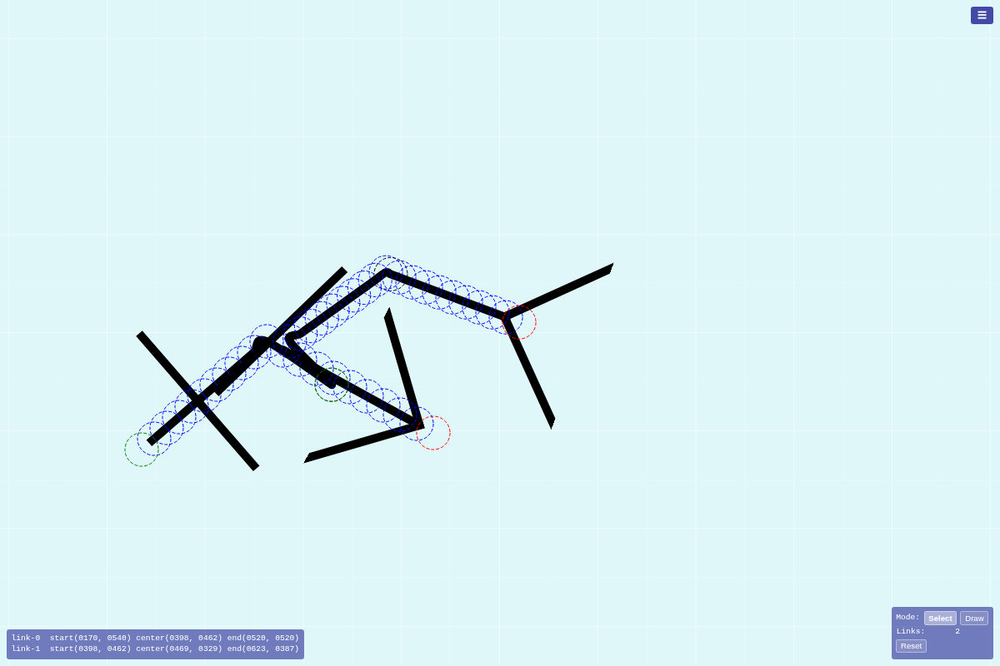

# Issue 27 Case Study: Drawing to Link Conversion Demo

Issue: https://github.com/konard/links-visuals/issues/27
Pull request: https://github.com/konard/links-visuals/pull/30

## Raw Data

- `raw/issue.json` - issue title, body, labels, timestamps, and empty comment list.
- `raw/issue-comments.json` - issue comments from the GitHub API; empty at the time of analysis.
- `raw/pr.json` - PR 30 metadata before implementation.
- `raw/pr-conversation-comments.json` - PR conversation comments; empty at the time of analysis.
- `raw/pr-review-comments.json` - inline review comments; empty at the time of analysis.
- `raw/pr-reviews.json` - submitted reviews; empty at the time of analysis.
- `raw/online-research.json` - external references reviewed while planning the implementation.

## External Research

- [W3C Pointer Events Level 3](https://www.w3.org/TR/pointerevents3/) defines a unified input model for mouse, pen, and touch pointers. This directly fits the Apple Pencil and tablet requirement.
- [MDN `touch-action`](https://developer.mozilla.org/en-US/docs/Web/CSS/touch-action) documents the CSS control needed to keep browser gestures from intercepting drawing strokes. The new SVG uses `touch-action:none`.
- [D3 drag](https://d3js.org/d3-drag) is already compatible with the repo style, but this demo uses native Pointer Events so draw mode and select mode are unambiguous.
- [perfect-freehand](https://github.com/steveruizok/perfect-freehand) can create pressure-sensitive stroke outlines, but the issue asks for link geometry from the drawn path, not a brush-rendered stroke.
- [Paper.js `Path.simplify`](https://paperjs.org/reference/path/#simplify) is a mature path simplification option. A small local simplifier is enough here because the path remains a blueprint link, not a full drawing document.

## Requirement Inventory

1. Add a demo named `draw.html`.
   - Implemented as a standalone HTML demo following the existing `blueprint.html` and `grid.html` pattern.

2. Support Apple Pencil, iPad Pro, and similar pen/touch hardware.
   - Implemented with Pointer Events on the SVG drawing surface and `touch-action:none`.

3. Drawing a line creates a link where the first point is start, the last point is end, and the middle of the drawn path is center.
   - Implemented in `js/draw-link.mjs`; center is computed at 50% of polyline path length, not by raw point index.

4. Keep the path close to the original drawing.
   - The drawn polyline is simplified by distance, capped for performance, and rendered through the existing blueprint Catmull-Rom-to-cubic path helper.

5. Preserve start, end, center, and freely placed intermediate points.
   - Rendered controls use green start, red end, black center, and blue intermediate circles.

6. Match `blueprint.html` element style exactly.
   - The demo reuses `buildBlueprintPathData`, `appendBlueprintEndpointMarkers`, `createBlueprintMetrics`, and `CONTROL_POINT_COLORS`.
   - Control circles keep transparent fill, dashed `4 2` outlines, fixed 1px stroke, and radius derived from the same grid spacing.

7. Support drawing links from centers of other links.
   - If a new stroke starts or ends within the center snap radius of an existing link, that endpoint is anchored to the source center.

8. Keep pinned endpoints attached when the source center moves.
   - Anchored endpoints are resolved at render time via `applyCenterAnchors`.

9. Support as many drawn links as practical.
   - Links are stored as independent polyline data, rendered in one SVG layer, and persisted in localStorage. Each stroke is simplified and capped to avoid unbounded point growth.

10. Provide two input modes: select/move and draw.
    - `Draw` mode creates links and does not move existing controls.
    - `Select` mode moves free controls and parent centers. Pinned endpoints are non-interactive so the source center remains selectable.

11. Include a deep case study under `docs/case-studies/issue-27`.
    - This folder contains raw data, online research, analysis, tests, and screenshot evidence.

## Solution Options Considered

### Option A: Use a full drawing library

Libraries such as perfect-freehand or Paper.js can manage freehand strokes and path simplification. This would help if the demo needed brush pressure rendering, erasing, layering, or document editing. It would add a new dependency and would still require custom conversion to blueprint link controls.

Decision: not chosen.

### Option B: Extend `grid.html`

`grid.html` already renders many blueprint-style links and uses reusable helpers. Extending it would risk coupling two different workflows: generated grid links and freehand-created links.

Decision: not chosen.

### Option C: Build `draw.html` with small pure geometry helpers

This keeps the freehand conversion logic testable, reuses existing blueprint rendering helpers, and avoids adding dependencies. Pointer Events cleanly separate drawing from selecting.

Decision: chosen.

## Implementation Summary

- Added `draw.html` with mobile-first panels, an infinite blueprint grid, draw/select mode buttons, reset, localStorage persistence, and Pointer Event input.
- Added `js/draw-link.mjs` for pure drawn-link geometry:
  - path length calculation
  - midpoint sampling
  - semantic center insertion
  - point simplification
  - center snap detection
  - anchored endpoint rendering
- Added `tests/draw-link.unit.test.mjs` for the conversion contract.
- Added `tests/draw.e2e.test.mjs` for page load, drawing, center pinning, and select-mode movement of pinned centers.
- Updated `package.json` and `.github/workflows/e2e.yml` so CI runs the new tests.

## Verification

- `npm test`
- `RUN_E2E=true TEST_URL=http://localhost:8080 node --test tests/draw.e2e.test.mjs`
- `TEST_URL=http://localhost:8080 npm run test:e2e`

Saved logs:

- `raw/unit-test.log` - 55 unit tests passing.
- `raw/e2e-test.log` - 47 E2E tests passing across animated blueprint, blueprint, grid, and draw demos.

## Screenshot

