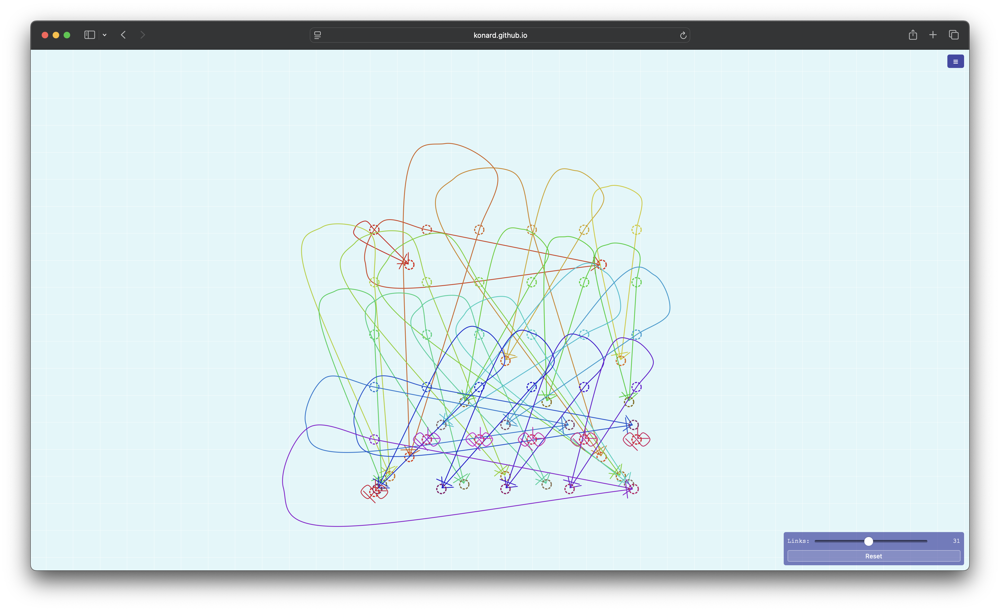
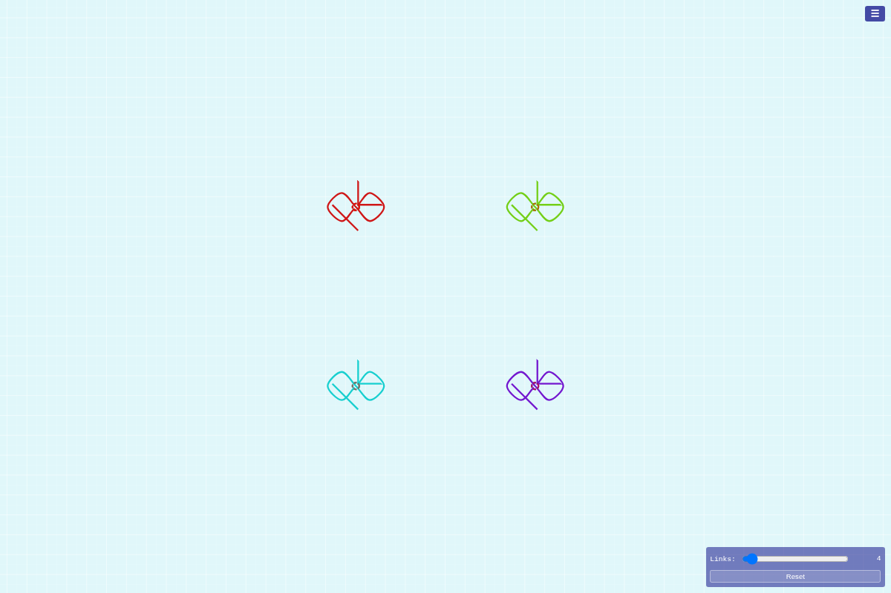

# Case Study: Issue #28 - Make grid mode closer to single-link mode

## Overview

**Issue:** [#28 - We need to make sure multi link (grid) mode is closer to single link mode](https://github.com/konard/links-visuals/issues/28)

**Pull request:** [#29](https://github.com/konard/links-visuals/pull/29)

**Affected page:** `grid.html`

**Reference pages that must be preserved:** `blueprint.html`, `animated-blueprint.html`

## Archived Evidence

- Raw issue data: [`raw/issue.json`](./raw/issue.json)
- Raw issue comments: [`raw/issue-comments.json`](./raw/issue-comments.json)
- Raw PR data/comments/reviews: [`raw/pr.json`](./raw/pr.json), [`raw/pr-conversation-comments.json`](./raw/pr-conversation-comments.json), [`raw/pr-review-comments.json`](./raw/pr-review-comments.json), [`raw/pr-reviews.json`](./raw/pr-reviews.json)
- Related issue/PR data: [`raw/related-issue-23.json`](./raw/related-issue-23.json), [`raw/related-pr-24.json`](./raw/related-pr-24.json), [`raw/related-pr-25.json`](./raw/related-pr-25.json), [`raw/related-pr-26.json`](./raw/related-pr-26.json)
- Issue screenshot: [`images/grid-mess-layout.png`](./images/grid-mess-layout.png)
- After screenshot: [`images/grid-after.png`](./images/grid-after.png)
- Reproduction log: [`raw/grid-e2e-before.log`](./raw/grid-e2e-before.log)
- Verification logs: [`raw/grid-e2e-after.log`](./raw/grid-e2e-after.log), [`raw/unit-after.log`](./raw/unit-after.log), [`raw/e2e-after.log`](./raw/e2e-after.log)

## Timeline

1. **March 17, 2026:** Issue #23 requested a grid page based on the best practices from `blueprint.html`. It specified a square grid, fixed link centers, self-referencing default links, one slider for link count, localStorage persistence, and a reset button.
2. **March 17, 2026:** PRs #24, #25, and #26 iterated on `grid.html`. They added a colored multi-link grid, then revised control point style and fixed centers to match issue #23 comments.
3. **June 21, 2026:** Issue #28 reported that grid mode still diverged too much from single-link mode, especially in control point/arrow proportions and layout reset behavior.
4. **June 25, 2026:** This investigation archived issue/PR data, reproduced the failures with a new grid E2E test, fixed the grid rendering model, and verified the full test suite.

## Requirements

1. Keep `blueprint.html` and `animated-blueprint.html` unchanged.
2. Make grid links look like the single-link blueprint, with color as the only visual override.
3. Preserve blueprint proportions for path strokes, endpoint markers, control point radii, snap threshold, IK segment length, and offsets.
4. Keep grid link centers fixed in a square grid.
5. Keep default links self-referencing, with start and end at the fixed center.
6. Preserve localStorage layout persistence.
7. Add a layout reset that actually restores default positions.
8. Archive issue data, related history, screenshots, logs, and analysis in `docs/case-studies/issue-28`.
9. Add tests that fail before the fix and pass after it.

## Root Causes

### 1. Mixed Scale Model

Before the fix, `grid.html` used one value for arrangement (`gridUnit`) and another for link geometry (`segLen = gridUnit * 0.35`). Control point radius used `gridUnit`, while path stroke and markers used `segLen`.

At a 1200 by 800 viewport with 4 links, the failing reproduction captured:

- Expected control radius from blueprint-style local spacing: `4.56`
- Actual control radius before fix: `25.84`

That made control circles much larger than the link geometry and made marker proportions diverge from the reference pages.

### 2. Reset Reused Dirty Link State

The reset button cleared localStorage and reset the link count, but `initLinks()` still preserved `oldLinks` when saved data was absent. After moving a link endpoint and clicking reset, the moved endpoint survived.

The failing reproduction captured:

- Expected `cp-end-0` x after reset: `448`
- Actual `cp-end-0` x after reset: `524`

### 3. Absolute Position Persistence

Saved layouts used absolute `{ x, y }` coordinates. That differs from the blueprint model, where point positions are represented as factors of `gridSpacing`. Absolute values make saved layouts less responsive to viewport and grid-size changes.

## Solution

1. Added `js/blueprint-link.mjs` as a small reusable helper for grid mode:
   - `createBlueprintMetrics(gridSpacing)`
   - `computeBlueprintLinkPoints(link, metrics)`
   - `buildBlueprintPathData(points, gridSpacing)`
   - `appendBlueprintEndpointMarkers(defs, ids)`
2. Updated `grid.html` so each grid cell has one local blueprint scale:
   - path stroke = `strokeFraction * gridSpacing`
   - marker size follows stroke through default `markerUnits="strokeWidth"`
   - control radius = `radiusFraction * gridSpacing`
   - IK segment length = `gridSpacing`
   - snap threshold = `snapFraction * gridSpacing`
3. Changed grid spacing to model each miniature link as an 8-unit blueprint link plus a 1-unit gap:
   - `gridSpacing = availableSize / (9 * gridSize - 1)`
   - `cellSpacing = 9 * gridSpacing`
4. Changed persisted layout from absolute coordinates to center-relative endpoint factors:
   - `startFactor`
   - `endFactor`
5. Made reset call `initLinks({ restoreSaved: false, preserveExisting: false })`, so the dirty in-memory layout is discarded.
6. Added backward compatibility for old absolute saved positions when possible.

## Options Considered

### Option A: Modify `blueprint.html` and `animated-blueprint.html` to share the new helper

Rejected for this stage because issue #28 explicitly says those pages cannot be changed.

### Option B: Keep all code inline in `grid.html`

Rejected because it would continue the divergence problem. The helper module keeps the blueprint-like link math in one place without touching protected pages.

### Option C: Use a full graph/edge library

Rejected for this repository stage. React Flow and similar libraries are useful references for reusable SVG edge components, but adding React or a graph framework would be a large dependency and architecture change for one static D3 page.

## Online Research

- [MDN `markerUnits`](https://developer.mozilla.org/en-US/docs/Web/SVG/Reference/Attribute/markerUnits) confirms the default value is `strokeWidth`, which is why preserving path stroke scale also preserves marker scale.
- [MDN `patternUnits`](https://developer.mozilla.org/en-US/docs/Web/SVG/Reference/Attribute/patternUnits) documents `userSpaceOnUse`, matching the existing infinite grid pattern approach.
- [D3 drag documentation](https://d3js.org/d3-drag) supports the current D3 drag behavior used for endpoint control points.
- [React Flow custom edges](https://reactflow.dev/learn/customization/custom-edges) and [`getBezierPath`](https://reactflow.dev/api-reference/utils/get-bezier-path) are relevant examples of reusable SVG edge path helpers, but they do not justify adding a React dependency here.

No upstream/library bug was found, so no external repository issue was opened.

## Verification

Failing reproduction before fix:

```bash
RUN_E2E=true TEST_URL=http://localhost:8080 node --test tests/grid.e2e.test.mjs
```

Passing checks after fix:

```bash
npm test
TEST_URL=http://localhost:8080 npm run test:e2e
```

Results:

- Unit tests: passed.
- Grid E2E: passed.
- Full E2E suite: 42 tests passed.

## Visual Result

Before:



After:


